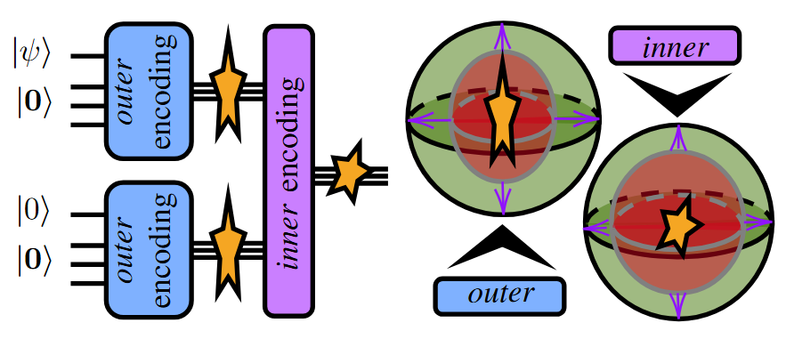

# Learning to Concatenate Quantum Codes

[
](https://arxiv.org/abs/2604.14931v1)
[
](https://github.com/nicomeyer96/varqec)

This repo contains the code for the paper ["Learning to Concatenate Quantum Codes", N. Meyer et al., arXiv:2604.14931, 2026](https://arxiv.org/abs/2604.14931v1).

> Concatenating quantum error correction codes scales error correction capability by driving logical error rates down double-exponentially across levels.
> However, the noise structure shifts under concatenation, making it hard to choose an optimal code sequence. We automate this choice by estimating the
> effective noise channel after each level and selecting the next code accordingly. In particular, we use learning-based methods to tailor small,
> non-additive encoders when the noise exhibits sufficient structure, then switch to standard codes once the noise is nearly uniform. In simulations,
> this level-wise adaptation achieves a target logical error rate with far fewer qubits than concatenating stabilizer codes alone--reducing qubit counts
> by up to two orders of magnitude for strongly structured noise. Therefore, this hybrid, learning-based strategy offers a promising tool for early
> fault-tolerant quantum computing.



## Setup and Installation

This codebase requires an installation of `python v3.14` and the following libraries:
- ```pennylane v0.43.0```
- ```torch v2.9.0```
- ```openqasm3[parser] v1.0.1```
- ```gast v0.7.0```

We recommend using a UV setup running `uv sync`.

## Running Script

The setup to be analyzed can be specified via the command-line parameters

- ``code`` The QEC/VarQEC code to use for the current concatenation layer (see `codes` for pre-trained options)
- ``p`` The overall noise strength of the Pauli channel
- ``px`` The Pauli-X proportion of the channel (`py` is computed as `1 - px - pz`, it has to hold `px + pz >= 1`)
- ``pz`` The Pauli-Z proportion of the channel (`py` is computed as `1 - px - pz`, it has to hold `px + pz >= 1`)

Running this script as
```
(uv run) python effective_channel.py --code CODE --p P --px PX --pz PZ
```
returns the effective channel under the error correction code.

---

For example, applying the ``[[5,1,3]] Perfect`` code to bitflip noise as
```
python effective_channel.py --code perfect --p 0.1 --px 1.0 --pz 0.0
```
yields the output
```
Pauli noise channel before correction:     px/p=1.00, py/p=0.00, pz/p=0.00 | p=0.1
Applying [[5,1]] `perfect` code ...
Effective pauli channel after correction:  px/p=0.01, py/p=0.50, pz/p=0.50 | p=0.0815
```

---

Note that for the shown effective channel `px/p + py/p + pz/p = 1` might be slightly violated. 
However, this is solely due to a rounding artifact when printing output (easy to see by showing higher accuracy).

## Acknowledgements

We acknowledge the use of the [VarQEC library](https://github.com/nicomeyer96/varqec) for generating the noise-adapted codes.

**Funding:** The research was supported by the German Federal Ministry of Research, Technology and Space, 
funding program Quantum Systems, via the project [**Q-GeneSys**](https://www.iis.fraunhofer.de/de/ff/lv/dataanalytics/anwproj/q-genesys1.html), grant number 13N17389. The research is also part of the 
[**Munich Quantum Valley** (MQV)](https://www.munich-quantum-valley.de/), which is supported by the Bavarian state government with funds from the Hightech Agenda 
Bayern Plus.

## Citation

If you use this implementation or results from the paper, please cite our work as

```
@article{meyer2026learning,
  title={Learning to Concatenate Quantum Codes},
  author={Meyer, Nico and Mutschler, Christopher and Seu{\ss}, Dominik and Maier, Andreas and Scherer, Daniel D.},
  journal={arXiv:2604.14931},
  year={2026},
  doi={10.48550/arXiv.2604.14931}
}
```

## License

Apache 2.0 License
